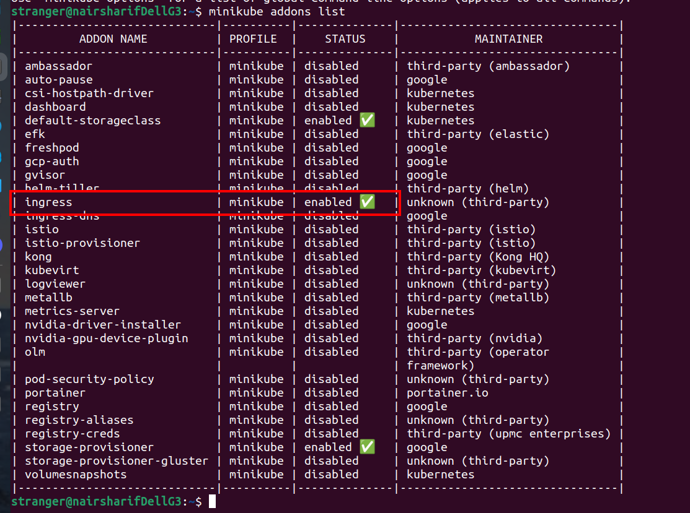

Часть задания, которую я выделил жирным шрифтом, уже выполнена в предыдущем ДЗ

Манифесты расположены в каталоге [manifests](manifests)

Однако, для работы объекта kubernetes ingress необходимо, чтобы какая-то реализация ingress контроллера уже была установлена. Используем самый простой вариант - контроллер в составе minikube, я его уже устанавливал ранее командой `minikube addons enable ingress`

проверяем запуск подов

все ОК, можем перейти в каталог с манифестами и запустить их все

чтобы увидеть рерайт по имени, недостаточно сделанных изменений в манифесте, нужно посмотреть реальный адрес ingress

и затем добавить запись в /etc/hosts

`192.168.49.2    arch.homework`

после чего получаем доступ в браузере

