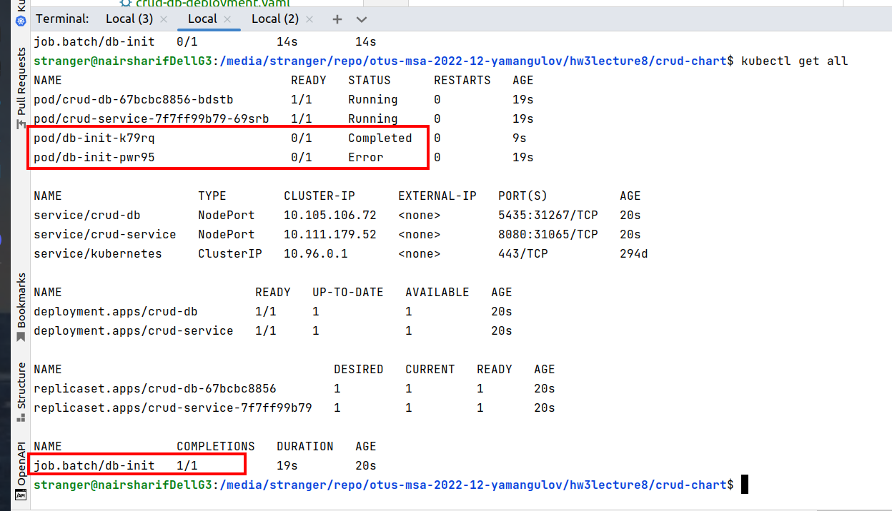

Задание выполнено:

1) ДЗ на github https://github.com/yamangulov/otus-msa-2022-12-yamangulov/pull/3
2) Для проверки приложения выполняем следующие шаги:
- заходим в [каталог ДЗ](crud-chart)
- выполняем команду `helm install crud-chart .`
- несколько раз вызываем команду `kubectl get all`, чтобы убедиться, что Job инициализаци БД выполнился на каком-то из повторных запусков, например:

- команда применения первоначальных миграций выполняется в [Job](crud-chart/templates/crud-db-init-job.yaml), ее можно увидеть в опции `command`
- команда kubectl apply -f в данном случае не нужна, так как я все сделал с использование helm, и при запуске чарта в любом порядке все объекты будут корректно созданы, ошибка в Job устраняется настройкой 5 повторных перезапусков
3) [Коллекция postman](simple-crud.postman_collection.json) (не забываем, что адрес arch.homework должен быть прописан в /etc/hosts по аналогии с предыдущим ДЗ, а также, что id создаваемых и удаляемых объектов usr в БД у вас могут отличаться, используйте свои значения, сверяясь с вашей БД)